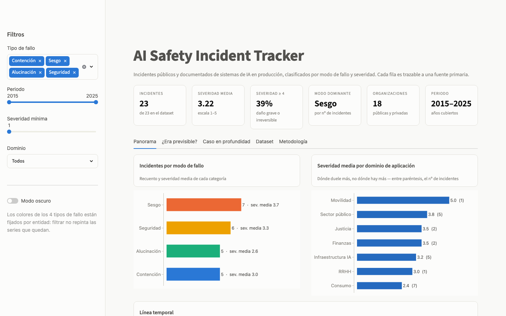
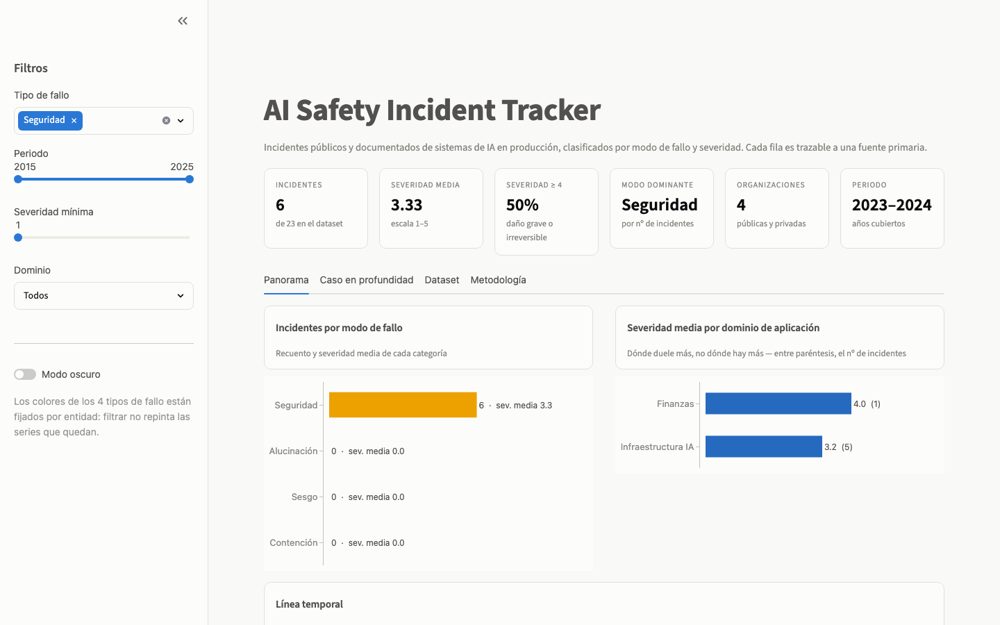
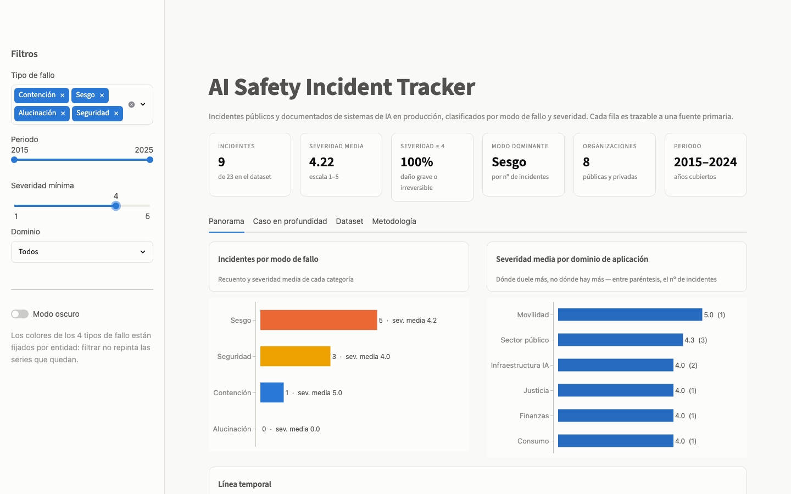
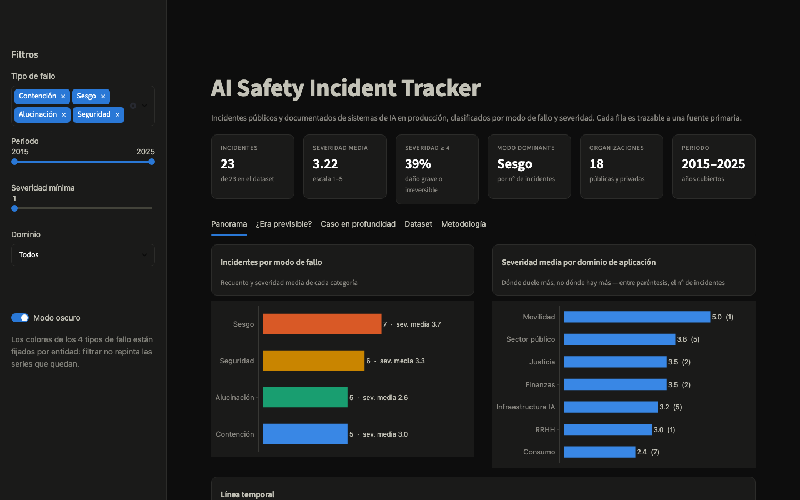
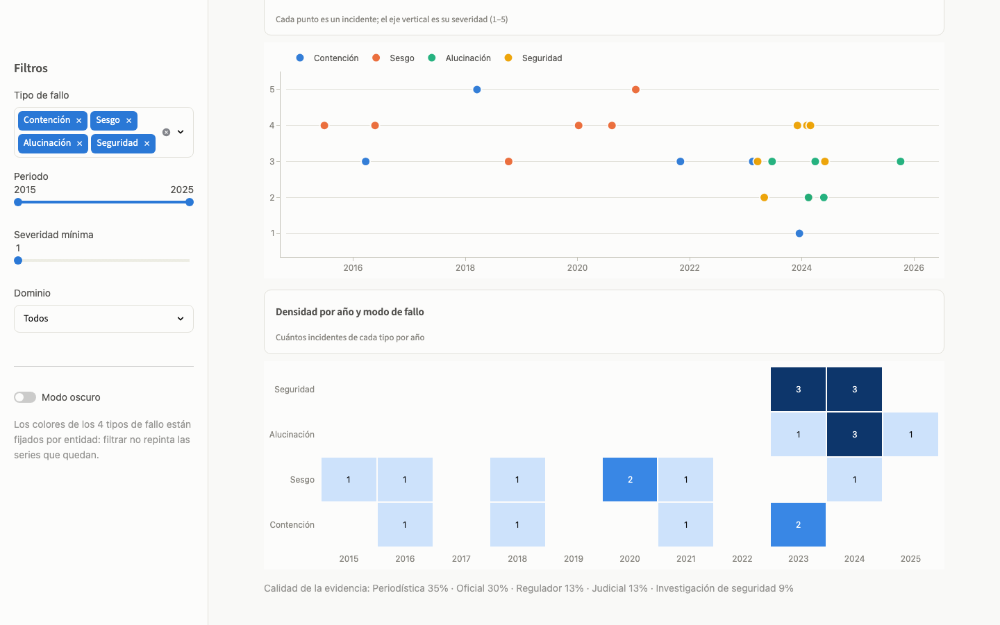
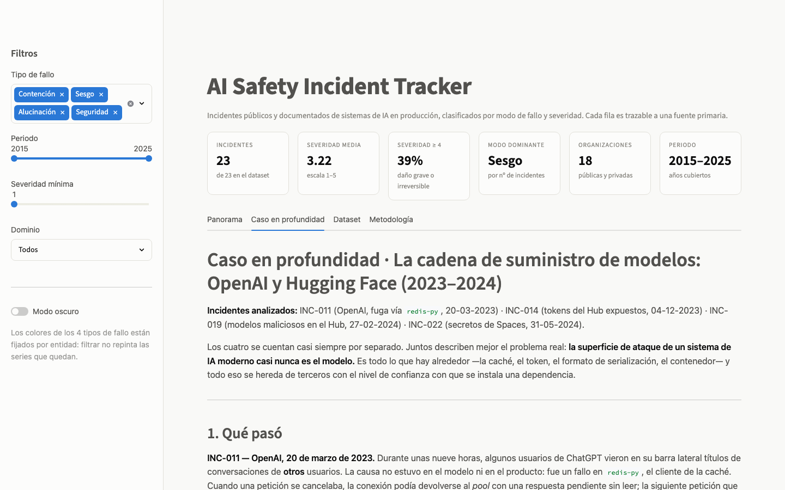

# AI Safety Incident Tracker

[](https://ai-safety-incidents.streamlit.app)

**▶ [ai-safety-incidents.streamlit.app](https://ai-safety-incidents.streamlit.app)** — dashboard desplegado, sin instalar nada.

Dashboard que clasifica **23 incidentes públicos y documentados de sistemas de IA en producción**
(2015–2025) por modo de fallo y severidad, con un análisis de causa raíz de un caso real.

No es un agregador de titulares: es el formato en que un analista técnico convierte ruido en una
lectura accionable — taxonomía explícita, rúbrica de severidad escrita, trazabilidad a fuente
primaria en cada fila y limitaciones declaradas antes de que nadie cite una cifra.


---

## Qué hay dentro

| | |
|---|---|
| **Dataset** | 23 incidentes, 13 columnas, contrato validado en carga → [`data/incidents.csv`](data/incidents.csv) · [metodología](data/DATASET.md) |
| **Dashboard** | 4 vistas (Panorama · Caso en profundidad · Dataset · Metodología), filtros por tipo, periodo, severidad y dominio |
| **Caso en profundidad** | [La cadena de suministro de modelos: OpenAI y Hugging Face (2023–2024)](case_studies/cadena-de-suministro-openai-huggingface.md) — 4 incidentes, causa raíz común y 7 controles que lo habrían evitado |
| **Tests** | 35 tests sobre el contrato del dataset, las agregaciones y las figuras |

## Arrancar

```bash
git clone <url-del-repo> && cd ai-safety-incidents
python3 -m venv .venv && .venv/bin/pip install -r requirements.txt
.venv/bin/streamlit run app.py
```

Tests: `.venv/bin/pip install -r requirements-dev.txt && .venv/bin/python -m pytest`

Desplegado en [Streamlit Community Cloud](https://ai-safety-incidents.streamlit.app): repo, rama
`main`, `app.py` y Python 3.12 en *Advanced settings*. No necesita variables de entorno ni secretos.

---

## Las decisiones, y por qué

### 1. El dataset se valida en carga y la app falla ruidosamente

Un dataset mantenido a mano es la pieza frágil de un proyecto así. Una fecha en otro formato o una
severidad de `7` no producen un error: producen una **barra silenciosamente equivocada**, que es
mucho peor. Por eso `aisid.data.validar` comprueba en cada arranque columnas, huecos, ids duplicados,
taxonomía, rango de severidad, formato y no-futuro de la fecha, y URL absoluta — y `load_incidents`
levanta `DatasetError` en lugar de seguir adelante. Los tests recorren cada regla con una fila
corrupta distinta.

### 2. Cuatro categorías, definidas por el fallo y no por el síntoma

`contención · sesgo · alucinación · seguridad`. Muchos incidentes encajarían en dos: el chatbot de
Air Canada es a la vez una alucinación y un fallo de contención. La regla de desempate está escrita
en [`data/DATASET.md`](data/DATASET.md): manda **el fallo que hizo posible el daño**, no el síntoma
más visible. Una taxonomía sin regla de desempate no es una taxonomía, es una nube de etiquetas.

### 3. La severidad mide daño materializado, no notoriedad

Escala 1–5 con rúbrica escrita y ejemplo por nivel. Que sea un juicio editorial es inevitable; que
sea un juicio **auditable** no lo es. Consecuencia deliberada: los cuatro incidentes del caso en
profundidad puntúan 3–4, por debajo de Uber ATG o del escándalo de las ayudas holandesas. El riesgo
sistémico y el daño consumado son ejes distintos y la escala solo mide uno.

### 4. El color sigue a la entidad, nunca a su posición en el ranking

Cada tipo de fallo tiene un color fijo en todos los gráficos y en todos los filtros. Si quitas
"Sesgo", los otros tres **no se repintan** — el error de dataviz más común en un dashboard con
filtros, porque destruye la lectura entre estados. Hay un test que lo verifica
(`test_color_sigue_a_la_entidad_no_al_ranking`).

Las dos paletas (clara y oscura, con pasos propios cada una, no un volteo automático) pasan las seis
comprobaciones del validador de color: banda de luminosidad, suelo de croma, separación en las tres
formas de daltonismo, suelo de visión normal y contraste sobre la superficie. La paleta clara emite
un aviso de contraste en dos tintas, lo que obliga a **etiquetas directas visibles y a una vista de
tabla**: ambas están implementadas. Un gráfico nunca es la única forma de leer el dato.

### 5. Un eje por gráfico

Nada de doble eje Y. Recuento y severidad media son magnitudes distintas: la barra codifica el
recuento y la severidad media va como etiqueta directa. La severidad por dominio es su propio
gráfico, con una sola tinta secuencial porque es una magnitud, no una identidad.

### 6. El tema viaja en la URL

`?tema=dark` — un enlace compartido llega como se envió. También es lo que hace reproducible la
grabación de la demo.

---

## El caso en profundidad

[**La cadena de suministro de modelos: OpenAI y Hugging Face**](case_studies/cadena-de-suministro-openai-huggingface.md)
analiza cuatro incidentes que casi siempre se cuentan por separado:

- **INC-011** · OpenAI, marzo 2023 — títulos de conversaciones ajenas por un fallo en `redis-py`.
- **INC-014** · diciembre 2023 — 1.681 tokens válidos expuestos, varios con permiso de **escritura**
  sobre organizaciones como Meta-Llama, Bloom o Pythia.
- **INC-019** · febrero 2024 — ~100 modelos maliciosos en el Hub; uno abría una *reverse shell* al
  cargar el checkpoint.
- **INC-022** · mayo 2024 — acceso no autorizado a los secretos de Spaces.

La tesis: **la superficie de ataque de un sistema de IA moderno casi nunca es el modelo.** Es la
caché, el token, el formato de serialización y el contenedor — todo heredado de terceros con la
confianza con que se instala una dependencia. Ningún *eval* de seguridad del LLM habría evitado uno
solo de los cuatro. El caso cierra con siete controles concretos y con las preguntas que esto deja
para evaluar a un proveedor de IA.

---

## Capturas

| Panorama | Filtrado a fallos de seguridad |
|---|---|
|  |  |

| Solo severidad ≥ 4 | Modo oscuro |
|---|---|
|  |  |

| Serie temporal y densidad año × tipo | Caso en profundidad |
|---|---|
|  |  |

La demo del principio se regenera con `.venv/bin/python scripts/record_demo.py`, que levanta la app,
la recorre con Playwright y monta el GIF. La documentación visual no se actualiza a mano.

---

## Estructura

```
app.py                      Interfaz Streamlit (solo presentación)
src/aisid/
  data.py                   Contrato del dataset: validación y enriquecimiento
  metrics.py                Agregaciones (testeables sin levantar la app)
  charts.py                 Figuras Plotly
  theme.py                  Paletas clara/oscura y asignación fija tipo → color
data/
  incidents.csv             El dataset
  DATASET.md                Metodología, taxonomía, rúbrica y limitaciones
case_studies/               Análisis de causa raíz
scripts/record_demo.py      Regenera docs/demo.gif y las capturas
tests/                      35 tests
```

## Limitaciones

Están escritas en detalle en [`data/DATASET.md`](data/DATASET.md#limitaciones--leer-antes-de-citar-cifras).
Resumen: muestra anglófona, sesgo de visibilidad (solo entra lo que alguien publica), severidad como
juicio editorial y N pequeño — las tendencias temporales son ilustrativas, no inferencia estadística.

## Roadmap

- Ingesta semiautomática desde la [AI Incident Database](https://incidentdatabase.ai/) con
  deduplicación, manteniendo la clasificación como paso humano.
- Segundo eje de puntuación: **riesgo sistémico** (cuántos sistemas aguas abajo dependen del
  componente que falló), separado de la severidad del daño consumado.
- Comparación entre organizaciones: reincidencia por modo de fallo y calidad de la respuesta
  post-incidente.
